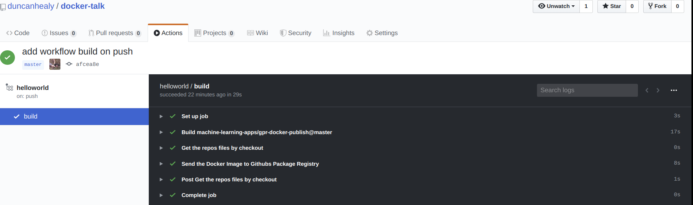

# First steps

use docker hub 

- [https://hub.docker.com/](https://hub.docker.com/)

use github

- [GCR Package Registry](https://github.com/features/packages) https://github.com/features/packages

others private cloud acr, gcr, aws...

docker.pkg.github.com/{OWNER}/{REPOSITORY}/{IMAGE_NAME}:{TAG}


## Github setup

https://help.github.com/en/github/authenticating-to-github/creating-a-personal-access-token-for-the-command-line

```bash
OWNER=duncanhealy
REPOSITORY=docker-talk
IMAGE_NAME=helloworld
TAG=latest
IMAGE_TAG=docker.pkg.github.com/${OWNER}/${REPOSITORY}/${IMAGE_NAME}:${TAG}

```


-  build sucess after adding 
```yaml
name: helloworld
on: push
jobs:
  build:
    runs-on: ubuntu-latest 
    steps:
    - name: Get the repos files by checkout
      uses: actions/checkout@master
    - name: Send the Docker Image to Githubs Package Registry
      uses: machine-learning-apps/gpr-docker-publish@master
      with:
        cache: true
#        branch_tag: true
        IMAGE_NAME: 'helloworld'
        TAG: 'latest'
        DOCKERFILE_PATH: 'helloworld/Dockerfile'
        BUILD_CONTEXT: './helloworld'
      env:
        GITHUB_TOKEN: ${{ secrets.GITHUB_TOKEN }} ## this is the secret from your account

# https://help.github.com/en/actions/reference/contexts-and-expression-syntax-for-github-actionsbuild_sucess_green_tick
```


- add a badge :)


- Workflow results



- view raw logs

```txt
2020-02-23T17:22:49.0113524Z Successfully built f58340cf28b8
2020-02-23T17:22:49.0159237Z Successfully tagged docker.pkg.github.com/duncanhealy/docker-talk/helloworld:afcea8ea8ee8
2020-02-23T17:22:49.0266913Z Successfully tagged docker.pkg.github.com/duncanhealy/docker-talk/helloworld:latest
2020-02-23T17:22:49.0532414Z The push refers to repository [docker.pkg.github.com/duncanhealy/docker-talk/helloworld]
2020-02-23T17:22:49.0827926Z 195be5f8be1d: Preparing
2020-02-23T17:22:50.6228710Z 195be5f8be1d: Pushed
```

- try pull image 

```
docker pull docker.pkg.github.com/duncanhealy/docker-talk/helloworld:latest
Error response from daemon: Get https://docker.pkg.github.com/v2/duncanhealy/docker-talk/helloworld/manifests/latest: no basic auth credentials
```

- private by default need to login to access


goto https://github.com/duncanhealy/docker-talk/packages


Change to type docker 

```
# Step 1: Authenticate
$ cat ~/GH_TOKEN.txt | docker login -u duncanhealy --password-stdin
# Step 2: Tag
$ docker tag IMAGE_ID docker.pkg.github.com/duncanhealy/docker-talk/IMAGE_NAME:VERSION
# Step 3: Publish
$ docker push docker.pkg.github.com/duncanhealy/docker-talk/IMAGE_NAME:VERSION
```

- after login

- docker pull 

```shell
docker pull docker.pkg.github.com/duncanhealy/docker-talk/helloworld:afcea8ea8ee8
```

- use this as a base image

- modify based on this image

- new Dockerfile 

```Dockerfile
FROM docker.pkg.github.com/duncanhealy/docker-talk/helloworld:afcea8ea8ee8
CMD echo "what kind of reply will you see from helloworld"
````

- we add a build for this helloworld2

- add another action to see how multiple actions can be run in parralel

```yaml
name: Compress images
on: 
  push:
    paths:
      - '**.jpg'
      - '**.png'
      - '**.webp'
jobs:
  build:
    name: calibreapp/image-actions
    runs-on: ubuntu-latest
    steps:
      - name: Checkout Repo
        uses: actions/checkout@master

      - name: Compress Images
        uses: calibreapp/image-actions@master
        with:
          githubToken: ${{ secrets.GITHUB_TOKEN }}
          jpegQuality: "80"
          pngQuality: "80"
          webpQuality: "80"
          ignorePaths: "node_modules/**,build"

```


### Build and push manually

- login
```docker login -u USERNAME -p TOKEN docker.pkg.github.com```

- check local images
```shell
docker images
IMAGE_ID=123
```

- tag a local image

```shell
docker tag ${IMAGE_ID} docker.pkg.github.com/${OWNER}/${REPOSITORY}/${IMAGE_NAME}:${VERSION}
```

- push to registry
```shell
docker.pkg.github.com/${OWNER}/${REPOSITORY}/${IMAGE_NAME}:${VERSION}
```

```shell
## . == path
 docker build -t docker.pkg.github.com/${OWNER}/${REPOSITORY}/${IMAGE_NAME}:${VERSION} .
 ```

## Dockerhub

docker login

cat ~/.docker/config.json

docker ps

docker run ${IMAGE_NAME}box

docker pull ubuntu:xenial

docker images


docker pull alpine

cat > Dockerfile <<EOF
FROM busybox
CMD echo "Hello world! This is my first Docker image."
EOF

docker build . -t ${OWNER}/${IMAGE_NAME}:1.0.0

:latest

sha1sum


Hmm containers 

interactively build and snapshot

- most people ignore this and prefer to build from base image or long complicated Dockerfile

docker commit -m="wut" ${IMAGE_NAME} ${OWNER}/${IMAGE_NAME}

docker images

docker push ${OWNER}/${IMAGE_NAME}

docker pull ${OWNER}/${IMAGE_NAME}

docker run ${OWNER}/${IMAGE_NAME} -p 8080:8080

docker run -p 8080:8080 ${OWNER}/${IMAGE_NAME}

docker ps -a 


docker exec -it ${OWNER}/${IMAGE_NAME} bash

docker exec -it `docker ps -q` bash

docker stop `docker ps -q`

docker volume ls

docker volume prune

docker run -v /dbdata --name dbstore ubuntu /bin/bash

docker run --rm --volumes-from dbstore -v $(pwd):/backup ubuntu tar cvf /backup/backup.tar /dbdata

docker run -v /dbdata --name dbstore2 ubuntu /bin/bash

docker run --rm --volumes-from dbstore2 -v $(pwd):/backup ubuntu bash -c "cd /dbdata && tar xvf /backup/backup.tar --strip 1"

- [A container tool repo](https://github.com/containers)
Let us install 

Podman 

```bash
. /etc/os-release
sudo sh -c "echo 'deb http://download.opensuse.org/repositories/devel:/kubic:/libcontainers:/stable/xUbuntu_${VERSION_ID}/ /' > /etc/apt/sources.list.d/devel:kubic:libcontainers:stable.list"
wget -nv https://download.opensuse.org/repositories/devel:kubic:libcontainers:stable/xUbuntu_${VERSION_ID}/Release.key -O- | sudo apt-key add -
sudo apt-get update -qq
sudo apt-get -qq -y install podman
```

nope - I'm not sure 

lets run it in a container

docker 

docker-compose

```
pip3 install podman-compose
pip3 install https://github.com/containers/podman-compose/archive/devel.tar.gz

```